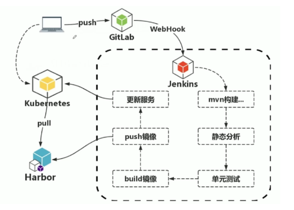

# DevOpsPractice
本仓库实现了一个DevOps例子
### 数据库设计
本项目重点在于DevOps因此数据库设计较为简单:  

**安装mysql：**
```shell
1.cd / & mkdir dockemysql
2.cd dockermysql  & mkdir conf & mkdir data
3.vim /dockermysql/conf/my.cnf
[client]
default-character-set=utf8
[mysql]
default-character-set=utf8
[mysqld]
character-set-server=utf8mb4
4.docker run --name ray-mysql -v /dockermysql/conf:/etc/mysql/conf.d -v /dockermysql/data:/var/lib/mysql -p 3306:3306 -e MYSQL_ROOT_PASSWORD=root -d mysql:latest
```

**课程服务：**
```mysql
CREATE DATABASE ray_course;
USE ray_course;
DROP TABLE IF EXISTS course;
CREATE TABLE course  (
                           id int UNSIGNED NOT NULL AUTO_INCREMENT,
                           course_name varchar(255) CHARACTER SET utf8mb4 COLLATE utf8mb4_0900_ai_ci NULL DEFAULT NULL,
                           description varchar(255) CHARACTER SET utf8mb4 COLLATE utf8mb4_0900_ai_ci NULL DEFAULT NULL,
                           PRIMARY KEY (id) USING BTREE
) ENGINE = InnoDB CHARACTER SET = utf8mb4 COLLATE = utf8mb4_0900_ai_ci ROW_FORMAT = Dynamic;

-- ----------------------------
-- Table structure for pr_stu_course
-- ----------------------------
DROP TABLE IF EXISTS pr_stu_course;
CREATE TABLE pr_user_course  (
                                  student_id int NOT NULL,
                                  course_id int NOT NULL,
                                  PRIMARY KEY (student_id, course_id) USING BTREE
) ENGINE = InnoDB CHARACTER SET = utf8mb4 COLLATE = utf8mb4_0900_ai_ci ROW_FORMAT = Dynamic;

SET FOREIGN_KEY_CHECKS = 1;
```
**用户服务：**
```mysql
CREATE DATABASE ray_user;
USE ray_user;
DROP TABLE IF EXISTS user;
CREATE TABLE user  (
                            id int UNSIGNED NOT NULL AUTO_INCREMENT,
                            name varchar(50) CHARACTER SET utf8mb4 COLLATE utf8mb4_0900_ai_ci NULL DEFAULT NULL,
                            email varchar(50) CHARACTER SET utf8mb4 COLLATE utf8mb4_0900_ai_ci NULL DEFAULT NULL,
                            password varchar(125) CHARACTER SET utf8mb4 COLLATE utf8mb4_0900_ai_ci NULL DEFAULT NULL,
                            mobile varchar(25) CHARACTER SET utf8mb4 COLLATE utf8mb4_0900_ai_ci NULL DEFAULT NULL,
                            PRIMARY KEY (id) USING BTREE
) ENGINE = InnoDB CHARACTER SET = utf8mb4 COLLATE = utf8mb4_0900_ai_ci ROW_FORMAT = Dynamic;
SET FOREIGN_KEY_CHECKS = 1;
```

### 消息服务

#### 主要功能 

- 发送邮件or短信

#### 环境准备

- redis：用来存储验证码  
  ``docker run -d --name -p 6379:6379 redis:6.0``
- Nacos-server：注册中心  
  ``docker run --name practiceNacos  -e MODE=standalone -p 8849:8848 -d nacos/nacos-server:2.0.2``
  
- 邮箱授权码

### 用户服务

#### 主要功能

- 登陆  
  ``用户输入信息，请求到用户服务，用户服务调用单点登陆服务根据id获取JWT``
- 注册  
  ``用户在注册界面，调用信息服务发送验证码，最后调用用户服务注册用户``
- 获取用户信息  
  ``根据用户id获取用户信息，该接口课程服务将调用``

### 单点登陆服务

#### 主要功能

- 生成token
  ``通过jwt工具类生成``
- 校验token

### 课程服务

#### 主要功能

- 查看所有课程
- 查看学生选课情况

### 网关服务

#### 主要功能

- 通过路径分发到不同的服务

### 实现CI/CD

Gitlab+Jenkins+k8s

#### 流程图
客户端push代码到git仓库触发webhook就可以触发jenkins与k8s的持续集成及部署


#### 步骤

- 安装docker环境
- 安装Harbor作为镜像仓库
- 准备kubernetes集群环境，并部署好我们上面的微服务
- 安装Gitlab与Jenkins
- 配置Webhook
- 配置Jenkins:不勾选防止跨站点请求，勾选Allow anonymous read access
- 写脚本
```groovy
#!groovy
pipeline{
    agent any
    
    stages{
        stage('获取代码'){
            steps{
                echo "start fetch code from git:仓库地址"
                ###待执行的操作
            }
        }
        stage('静态分析'){
            steps{
                echo "start code check"
                ###待执行的操作
            }
        }
        stage('编译+单元测试'){
            steps{
                echo "start compile"
                ###待执行的操作
            }
        }
         stage('构建镜像'){
            steps{
                echo "start build image"
                ###待执行的操作
            }
        }
         stage('更新发布'){
            steps{
                echo "start deploy"
                ###待执行的操作
            }
        }
    }
}
```